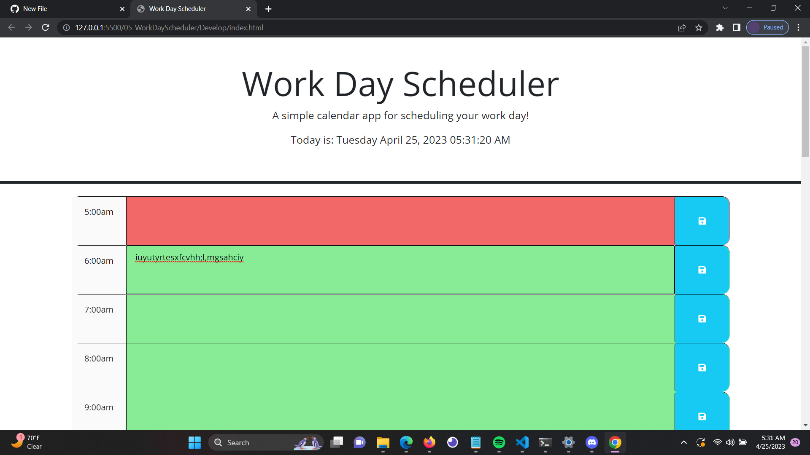

# 05 Third-Party APIs: Work Day Scheduler
This application is a simple calendar that allows a user to save events for each hour of the day.

## The challange
Create a simple calendar application that allows a user to save events for each hour of the day.
This app will run in the browser and feature dynamically updated HTML and CSS powered by jQuery.

## User Story
AS AN employee with a busy schedule
I WANT to add important events to a daily planner
SO THAT I can manage my time effectively

## Acceptance Criteria

```md
GIVEN I am using a daily planner to create a schedule
WHEN I open the planner
THEN the current day is displayed at the top of the calendar
WHEN I scroll down
THEN I am presented with timeblocks for standard business hours
WHEN I view the timeblocks for that day
THEN each timeblock is color coded to indicate whether it is in the past, present, or future
WHEN I click into a timeblock
THEN I can enter an event
WHEN I click the save button for that timeblock
THEN the text for that event is saved in local storage
WHEN I refresh the page
THEN the saved events persist
```
## Features
Simple and easy-to-use and understand interface
Allows users to add and save events
Provides a calendar view of the whole 24 hours of the day for scheduling tasks.

## Screenshots
The following demonstrates the applications functionality:



## Instllation
Clone the repository or download the zip file.
Open the downloaded folder in your preferred code editor.
Open the index.html file in your web browser.

## How to use
Users can create new events by typing text into the following hour shown on the left side. Save button on right side. and date n time in header.

## Contrbuting
Contributions to the third-Party APIs: Work Day Scheduler are welcome! If you have any suggestions for features you'd like to see or issues you've found, please please feel free to open an issue or create a pull request.

## Sources
google
bcs in slack
https://getbootstrap.com/
https://day.js.org/en/
https://jquery.com/
https://www.w3schools.com/js/js_let.asp
https://www.w3schools.com/js/js_json.asp
https://www.w3schools.com/js/js_json_parse.asp
https://www.w3schools.com/js/js_api_web_storage.asp
https://www.w3schools.com/js/js_json_parse.asp
https://www.w3schools.com/jquery/default.asp
https://www.w3schools.com/js/js_dates.asp
https://stackoverflow.com/

## Credits 
This Code was created by Savony Panton as a project for Full stack development bootcamp at University of Arizona.

## Links to the challange

The challange was upload to Github at the following
GitHub Repo: https://github.com/Savonyp/05-WorkDayScheduler

Website: http://127.0.0.1:5500/05-WorkDayScheduler/Develop/index.html

